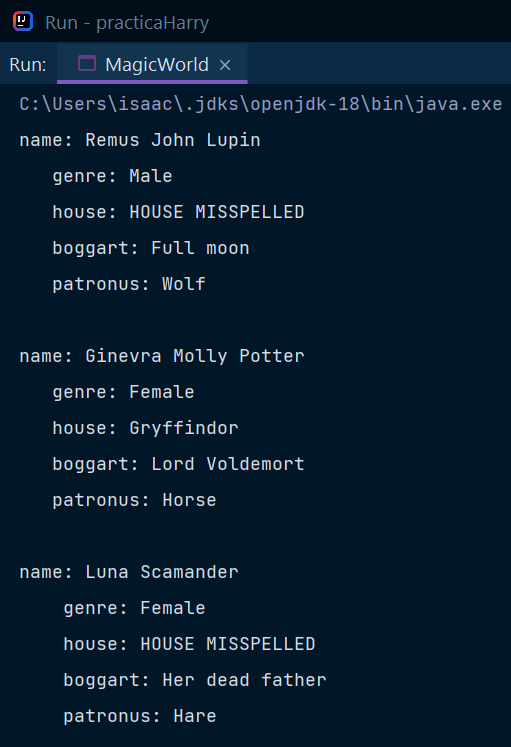
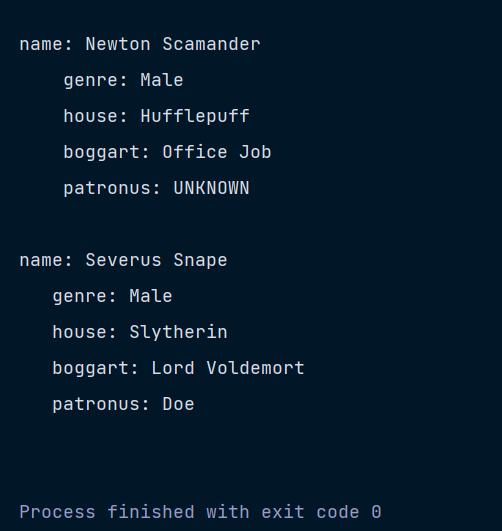
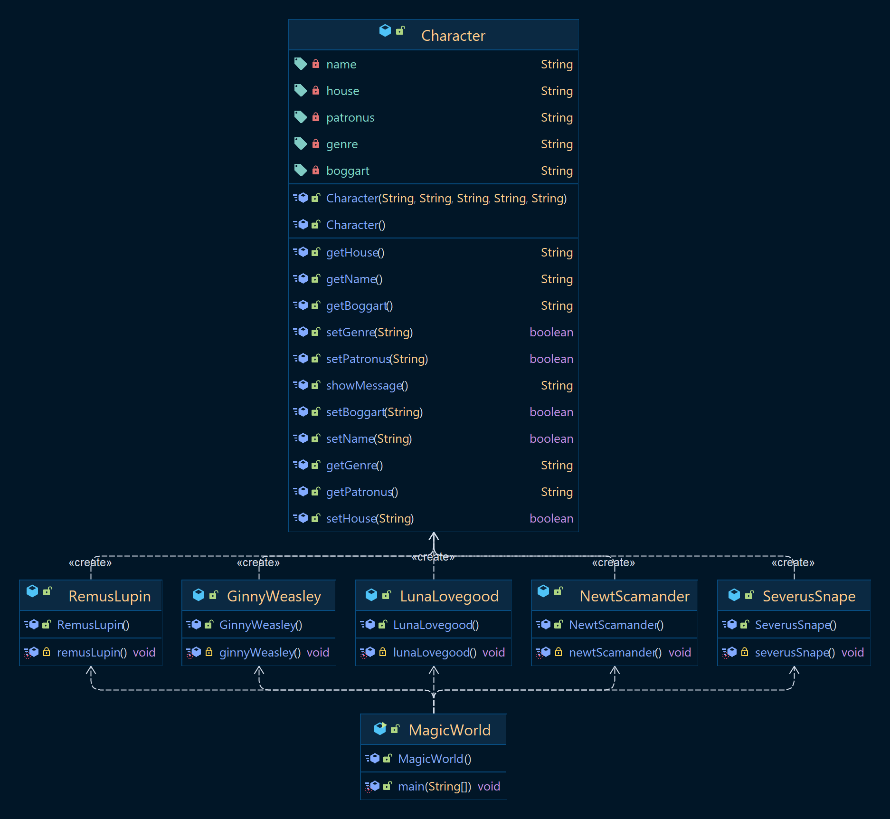

## Practice: Modeling

This practice consist in the modeling of five characters from the *Harry Potter series* with their main characteristics.

Each character is defined by a *constructor* or by *setters* and their parameters are shown by a *method* or by *getters*.

- [Professor Lupin](src/RemusLupin.java) and [Ginny](src/GinnyWeasley.java) are defined by the [parameterized constructor](src/Character.java#L12-L24) and are shown by the [showMessage()](src/Character.java#L75-L81) method.
- [Luna](src/LunaLovegood.java) is defined by [setters](src/Character.java#L32-L73) and shown by [getters](src/Character.java#L26-L30).
- [Newt](src/NewtScamander.java) is defined by the same *parameterized constructor* aforementioned and is shown by *getters*.
- [Professor Snape](src/SeverusSnape.java) is also defined by *setters* and shown by the *showMessage()* method.

Finally, the *main method* is in [Magic World](src/MagicWorld.java)'s Java file.

---

### Result

Something to note is that if it's written incorrectly the house parameter, it's obtained a String "HOUSE MISSPELLED" in place.

---

### Class Diagram

